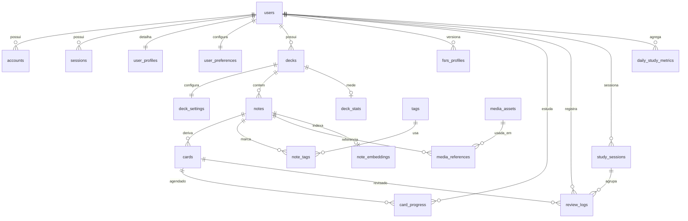
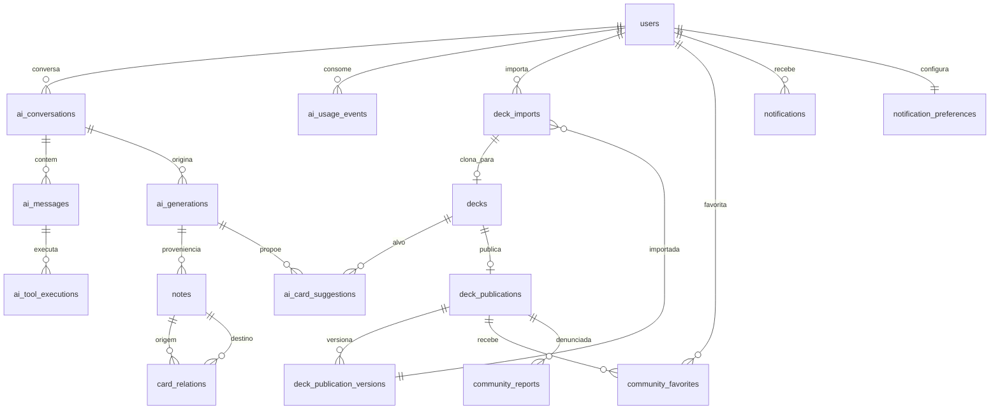

# Fase 0 — Arquitetura proposta

## 1. Visão geral

Monólito modular Next.js (App Router) com **dois processos**:

```
                    Cloudflare (DNS + proxy, *.mnrs.com.br)
                                   │
                            Nginx (443, map $host → porta)
                                   │
                     ┌─────────────┴──────────────┐
                     │ flashcards-web (PM2, :3060) │  Next.js standalone
                     └─────────────┬──────────────┘
                                   │
        ┌──────────────────────────┼───────────────────────────┐
        │                          │                           │
  PostgreSQL 16 (localhost)   Object Storage Magalu       OpenAI API
  base `flashcards`           (bucket de mídias)          (Responses API)
  + pgvector + pg-boss             │                           │
        │                          │                           │
        └──────────┬───────────────┴───────────────────────────┘
                   │
     ┌─────────────┴──────────────┐
     │ flashcards-worker (PM2)     │  pg-boss: embeddings, thumbnails,
     └────────────────────────────┘  temperatura, notificações, otimização FSRS
```

- **Web e worker compartilham o mesmo código** (mesmo repo, mesmo build); o worker é um entrypoint separado (`src/workers/index.ts`) executado via tsx/node, não um segundo deploy.
- Escala futura: web escala horizontalmente (N processos PM2 atrás do Nginx — sessões em banco, sem estado em memória); worker escala por concorrência do pg-boss (jobs idempotentes e seguros para múltiplos workers); pg-boss é substituível por BullMQ/Redis atrás da interface `src/lib/jobs`.

## 2. Estrutura de módulos

```
src/
  app/                    # rotas (App Router), route handlers, server actions finas
  components/             # UI compartilhada (shadcn/ui + próprios)
  features/
    auth/  decks/  notes/  cards/  review/  dashboard/
    ai/  media/  community/  notifications/  stats/
  db/
    schema/               # drizzle schema por domínio (auth.ts, decks.ts, content.ts, study.ts, ai.ts, ops.ts)
    migrations/           # drizzle-kit generate (versionadas; nunca push em prod)
    rls/                  # policies SQL versionadas + testes
    client.ts             # pools (app e service) + withUserTransaction/withServiceTransaction
  lib/
    fsrs/                 # ReviewScheduler (wrapper ts-fsrs, tipos próprios do domínio)
    ai/                   # cliente, perfis fast/deep, tools, prompts versionados
    storage/              # abstração Object Storage (presigned/stream)
    jobs/                 # interface de fila + implementação pg-boss
    validation/           # schemas Zod compartilhados (content_json etc.)
    auth/                 # helpers de sessão/autorização
  workers/                # entrypoint worker + handlers de jobs
tests/
  unit/  integration/  e2e/
docs/
  architecture/  operations/
```

Cada `feature` expõe server actions/route handlers finos que delegam a services testáveis; autorização **sempre** no servidor, dentro de `withUserTransaction`.

## 3. Modelo de entidades

### 3.1 ERD (núcleo — Fases 1–4)



Fases 4/7: `notifications`, `notification_preferences`, `audit_logs` (audit_logs entra já na Fase 1, enxuto).

### ERD dos blocos IA (Fase 5) e comunidade (Fase 6)



Definições que faltavam (achado da revisão):
- **`card_relations`** — `(source_note_id, target_note_id, kind)` único; `kind` (`related` \| `possible_duplicate` \| `prerequisite`), `score real` (similaridade), `created_by` (`system` \| `ai` \| `user`), `status` (`suggested` \| `confirmed` \| `dismissed`), `owner_user_id` denorm. + policy. Alimentada pelo job de embeddings e pelas tools da IA.
- **`ai_card_suggestions`** — persistência do fluxo §9.5: `id`, `user_id`, `deck_id`, `ai_generation_id`, `payload jsonb` (card proposto), `status` (`pending` \| `accepted` \| `edited_accepted` \| `dismissed`), `created_at`, `resolved_at`. O "silenciar por deck" vive em `deck_settings.suggestions_enabled`.
- **`notifications`** — `id`, `user_id`, `kind`, `payload jsonb`, `channel` (`in_app` \| `email`), `created_at`, `read_at`, `sent_at`; `notification_preferences` — por `user_id` + `kind`: `enabled` (default **false** — opt-in), `quiet_hours_start/end`, `preferred_hour`.

### 3.2 Decisões de modelagem (refinamentos sobre a lista de referência)

| Tabela da lista | Decisão | Justificativa |
|---|---|---|
| `user_profiles` | **Mantida como tabela 1:1** (exigida no escopo da Fase 1): `display_name`, `timezone`, `locale`, `day_start_hour` (rollover do dia de estudo, default 4h), `onboarding_completed_at` | `users` fica restrita ao shape do Auth.js; perfil evolui sem tocar em tabela de autenticação |
| `deck_settings` | **Mantida como tabela 1:1** (exigida no escopo da Fase 1): `desired_retention_override`, `new_per_day_override`, `max_reviews_per_day_override`, `suggestions_enabled`, `weekly_new_cards_goal`, `exam_date` | separa configuração de identidade do deck; RLS herda o dono via `deck_id` |
| `deck_tags` | **Adiada** | Tags de nota cobrem o MVP; tags de baralho entram na Fase 6 (descoberta comunitária) |
| `card_embeddings` | **Renomeada `note_embeddings`** (1 por nota) | O texto semântico vive na nota; cards cloze da mesma nota compartilham conteúdo. Dedup/sugestão operam por nota |
| `study_session_items` | **Adiada** — `review_logs.study_session_id` nullable cobre a agregação | Item de sessão só faria sentido com planejamento de fila persistido, que não é MVP |
| `feature_flags` | **Adiada** | Env vars bastam até haver mais de um usuário-alvo |
| `deck_stats` (nova) | Tabela materializada por deck: contagens, due hoje/72h, temperatura, frescor, `computed_at` | Dashboard sem agregações caras em request; atualizada por job + on-demand debounced |

### 3.3 Campos críticos

**`notes`** — `id uuid pk`, `owner_user_id`, `deck_id`, `note_type` (`basic` \| `cloze`; futuros: `image_occlusion`, `typed_answer`, `basic_reversed`), `content_json jsonb` (schema versionado, ver §4), `content_version int`, `search_text text` (gerado no app a partir do JSON; índice GIN `to_tsvector('portuguese', ...)` + `pg_trgm`), `source_type` (`human` \| `ai` \| `import`), `created_by_user_id`, `ai_generation_id` nullable (proveniência dura), `created_at`, `updated_at`, `deleted_at` (soft delete).

**`cards`** — `id uuid pk`, `note_id`, `owner_user_id` (denorm.), `variant int` (**contador monotônico por nota**: `max(variant)+1`, nunca reutilizado nem posicional — um grupo novo jamais herda o variant de um card `removed`; a identidade semântica é `cloze_group_key`, o variant só desambigua a unique), `cloze_group_key text` nullable (chave estável do grupo, ver §5), `status` (`active` \| `suspended` \| `removed`), `content_fingerprint text` (hash do conteúdo derivado — consumido pela regra de resgate do §5), `created_at`, `updated_at`. Único: `(note_id, variant)`.

**`decks`** — `id uuid pk`, `owner_user_id`, `name`, `description`, `status` (`active` \| `maintenance` \| `completed` \| `paused` \| `archived`), `visibility` (`private` \| `unlisted` \| `public`, default `private`), `position int`, timestamps + `deleted_at`.

**`user_preferences`** — `user_id pk`, `desired_retention` (default 0.90), `new_cards_per_day`, `max_reviews_per_day`, `review_order_preference`, `theme` (`system` \| `light` \| `dark`), timestamps. (Timezone/locale/rollover vivem em `user_profiles` — fonte única para a convenção de dia de estudo, §7.4.)

**`tags` / `note_tags`** — `tags`: `id`, `owner_user_id`, `name`, `UNIQUE(owner_user_id, name)`, policy RLS padrão. `note_tags`: `(note_id, tag_id)` pk composta, `owner_user_id` denorm.

**`audit_logs`** — `id bigserial`, `actor_user_id` nullable (null = sistema), `action`, `entity_type`, `entity_id`, `metadata jsonb`, `request_id`, `created_at`. Append-only para `flashcards_app` (INSERT/SELECT).

**`study_sessions`** — `id uuid`, `user_id`, `deck_id` nullable (null = sessão geral), `kind` (`review` \| `cram` \| `rescue` \| `five_min`), `started_at`, `ended_at`, contadores denormalizados (`cards_reviewed`, `time_ms`), timestamps.

**`deck_stats`** — `deck_id pk`, `due_now`, `due_24h`, `due_72h`, `overdue_avg_days`, `retrievability_deficit`, `temperature smallint`, `freshness smallint`, `last_review_at`, `last_card_added_at`, `estimated_minutes`, `computed_at`. Escrita só via `withServiceTransaction` (job); leitura com RLS via join em `decks`.

**`card_progress`** — pk composta `(user_id, card_id)`; `state` (`new` \| `learning` \| `review` \| `relearning`), `due_at timestamptz` (precisão de minutos — learning steps são intra-dia), `last_reviewed_at`, `stability double precision`, `difficulty double precision` (float8: o ts-fsrs opera em float64; `real` truncaria e divergiria dos casos de referência), `elapsed_days`, `scheduled_days` (informativos — **deprecated no ts-fsrs; nunca fonte de lógica**, derivar de timestamps), `reps`, `lapses`, `learning_step int`, `suspended_at`, `buried_until`, `fsrs_version text`, `parameters_version int` (FK lógica a `fsrs_profiles`), `desired_retention real`, timestamps. Índice parcial: `(user_id, due_at) WHERE suspended_at IS NULL AND state != 'new'` + índice para introdução de novos.

**`review_logs`** — append-only; `id bigserial`, `user_id`, `card_id`, `study_session_id` nullable, `reviewed_at` (servidor), `client_reviewed_at`, `client_timezone`, `rating` (1–4; **nullable quando `origin='undo'`**), `state_before/after`, `due_before/after`, `stability_before/after`, `difficulty_before/after` (float8), **`learning_step_before/after`, `reps_before`, `lapses_before`** (sem eles o undo não restaura cards em learning — o scheduler usa o contador de steps), `elapsed_days`, `scheduled_days_before/after`, `retrievability real` (estimada no momento), `duration_ms`, `session_kind` (`review` \| `cram` \| `rescue`), `fsrs_version`, `parameters_version`, `idempotency_key uuid`, `origin` (`web` \| `undo` \| `import`), **`reverted_log_id`** (FK para o log desfeito, obrigatório em `origin='undo'`). **Único `(user_id, idempotency_key)`** — double-submit vira no-op. Sem UPDATE/DELETE pelo role runtime; undo é evento compensatório, nunca apaga linha. **Regra de consumo**: otimizador e estatísticas excluem os logs `origin='undo'` **e** os logs por eles referenciados via `reverted_log_id` (sem isso, parâmetros treinariam sobre reviews retratadas).

**`fsrs_profiles`** — `(user_id, version)` pk; `parameters jsonb` (array w), `desired_retention`, `source` (`default` \| `optimized`), `metrics jsonb` (log-loss etc.), `active bool`, `created_at`. Rollback = reativar versão anterior.

**`media_assets`** — `id uuid`, `owner_user_id`, `storage_key` (nome interno aleatório), `mime_type` (validado por magic bytes), `byte_size`, `width`, `height`, `sha256`, `status` (`pending` \| `ready` \| `failed`), `thumbnail_key` nullable, `created_at`, `deleted_at`. `media_references` — `(media_asset_id, note_id, slot)` com `alt_text` por uso; GC de órfãs por job quando `refs = 0` além de período de carência.

### 3.4 Comunidade (Fase 6) — publicação por snapshot

- `deck_publications` (1 por deck publicado: slug, visibilidade `public` \| `unlisted`, autor, licença, idioma, contadores).
- `deck_publication_versions` — snapshot **imutável** em jsonb (notas+cards depurados de metadados privados) + changelog + `content_hash`. Publicar de novo = nova versão.
- `deck_imports` — quem importou qual versão; importação **clona** o snapshot para `decks/notes/cards` do importador com `source_type='import'` e referência de origem; progresso do importador nasce em `card_progress` próprio. Atualização do autor nunca sobrescreve o clone; um aviso "nova versão disponível" permite diff/re-import manual.

Rejeitado: referenciar diretamente as notas vivas do autor (acoplamento, vazamento de edições privadas, RLS impraticável).

## 4. Formato de conteúdo (`content_json`)

Árvore JSON própria, versionada (`schemaVersion`), validada com Zod, **não** HTML:

```
NoteContentV1 = {
  schemaVersion: 1,
  front: Block[],          // notas basic
  back: Block[],
  text: Block[],           // notas cloze (campo único)
}
Block = paragraph | heading | list | codeBlock | image | formula | callout
Inline = text (marks: bold, italic, highlight, code) | cloze { groupKey, hint? } | math
```

- O editor Tiptap opera com schema ProseMirror **restrito a esses nós**; serialização ProseMirror→NoteContent e vice-versa com parser/serializer testados (inclusive property-based).
- Renderização de estudo: componente React que percorre a árvore (sem `dangerouslySetInnerHTML`); imagens via URL assinada/rota autenticada; fórmulas via KaTeX.
- `search_text` derivado da árvore (concatenação normalizada, cloze revelado) — alimenta FTS e embeddings.
- Migrações de schema de conteúdo: `schemaVersion` + migrador por versão (expand-and-contract no JSON).

## 5. Cloze: derivação e preservação de progresso

- Cada ocultação inline carrega `groupKey` (ex.: `g1`, `g2` — equivalente interno a `c1/c2`, jamais exposto ao usuário). Ocultações no mesmo grupo somem juntas.
- Nota cloze gera 1 card por `groupKey` distinto: `cards.variant` = índice estável, `cloze_group_key` = groupKey.
- Reedição da nota: recalcular grupos → matching em **duas passadas**:
  1. Por `cloze_group_key`: key mantida → card mantido, progresso preservado (mesmo que o texto mude); key nova → candidato a card novo; key ausente → candidato a removido.
  2. **Resgate por fingerprint** (é para isso que o fingerprint existe): candidatos a removido são pareados com candidatos a novo de `content_fingerprint` idêntico → o card antigo é mantido com `cloze_group_key` atualizado e o progresso **transferido**. Cobre apagar-e-recriar a mesma ocultação, recortar-e-colar o trecho e o editor recriar o node (casos em que o UniqueID gera key nova para conteúdo igual).
  3. Só então: novos restantes → card novo (`variant = max+1`, progresso `new`); removidos restantes → `status='removed'` (progresso e review_logs preservados; some das filas).
- Fingerprint = sha256 do conteúdo derivado (texto com o grupo oculto + resposta). Property-based tests cobrem explicitamente apagar-e-recriar e recortar-e-colar. Nested cloze fica previsto no formato (rejeitado pelo validador V1; aceito num V2 sem migração destrutiva).

## 6. Segurança e RLS (defesa em profundidade)

### 6.1 Roles PostgreSQL

| Role | Uso | Privilégios |
|---|---|---|
| `flashcards_owner` | migrations (CI/deploy) | dono do schema e tabelas; aplica `FORCE ROW LEVEL SECURITY` (que atinge inclusive o owner — por isso o owner **não** roda workload) |
| `flashcards_app` | runtime com contexto de usuário (web + handlers de jobs que agem por um usuário) | DML mínimo por tabela; **sem** BYPASSRLS, sem ownership; **sem grants nas tabelas Auth.js**; INSERT/SELECT apenas em `review_logs`, `audit_logs` e `ai_tool_executions` (append-only: sem UPDATE/DELETE) |
| `flashcards_service` | adapter do Auth.js + jobs de sistema sem usuário (GC de mídia, `deck_stats`, `daily_study_metrics`, otimização FSRS) + pg-boss | NOSUPERUSER, sem ownership, **BYPASSRLS** com DML restrito às tabelas que os jobs de sistema precisam + tabelas Auth.js + schema `pgboss` |
| `flashcards_backup` | pg_dump diário e pré-migration | SELECT em tudo + **BYPASSRLS** (sem BYPASSRLS o `pg_dump` falha ou despeja **zero linhas** das tabelas sob FORCE RLS — dump silenciosamente vazio) |
| `flashcards_ro` | observabilidade (futuro) | SELECT com RLS |

Regras que fecham o modelo (achados da revisão adversarial):
- **Nenhum escape por GUC nas policies** (nada de `app.current_role='service'` — seria settável por qualquer SQLi rodando como `flashcards_app`). Acesso de sistema é por **role**, não por variável.
- `withUserTransaction` usa o pool `flashcards_app`; `withServiceTransaction` usa o pool `flashcards_service`. Os call-sites de `withServiceTransaction` são mantidos numa **allowlist verificada em CI** (grep/lint) — uso fora dela quebra o build.
- Teste de integração da Fase 1: um job de sistema lê dados de 2 usuários via `flashcards_service` (prova de que agregação funciona) e o mesmo código sob `flashcards_app` sem GUC lê zero linhas (prova do default-deny).
- **Teste-invariante em toda fase**: query em `pg_class` exigindo `relrowsecurity` e `relforcerowsecurity` verdadeiros para toda tabela fora de uma allowlist explícita (tabelas Auth.js, schema `pgboss`, tabela de migrations). No Drizzle 0.45 uma tabela sem `pgPolicy` nasce **sem RLS e totalmente acessível** — falha silenciosa que só esse invariante acusa. Convenção: migration que cria tabela traz policy + caso novo na suite RLS no mesmo PR.

pg-boss usa schema `pgboss` na mesma base: o SQL de criação é gerado pelos plans do CLI do pg-boss e aplicado como migration pelo owner; o worker roda com `migrate:false` e o pg-boss conecta como `flashcards_service` (o runtime de usuário não tem acesso ao schema `pgboss` nem `CREATE ON DATABASE`).

**Orçamento de conexões** (cluster compartilhado, `max_connections=100` para ~15 apps): web = pool app 6 + instância pg-boss send-only reusando o mesmo `pg.Pool` via opção `db` do construtor + pool service 2; worker = pool app 2 + pg-boss 5 (pool próprio) + pool service 2. **Teto agregado do app: ≤ 15 conexões**, verificado em `pg_stat_activity` como critério de aceite da Fase 7.

Detalhes verificados do padrão RLS (pesquisa + docs Drizzle/PostgreSQL):
- Policies declaradas **no schema Drizzle** (`pgPolicy` no 3º argumento do `pgTable`; roles via `pgRole(...).existing()`; `entities: { roles: ... }` no drizzle.config) e aplicadas **exclusivamente por `drizzle-kit generate` + `migrate`** — `push` tem bug conhecido com policies (issue #3504) e fica proibido além de dev.
- Policies leem `current_setting('app.current_user_id', true)` — o segundo argumento `true` evita exceção quando o GUC não foi definido (sessão vira default-deny, não erro).
- `db.transaction()` do Drizzle fixa uma conexão física para o callback inteiro — o `set_config(..., true)` e as queries garantidamente compartilham a conexão, e o contexto morre no COMMIT/ROLLBACK (nada vaza para o pool).
- Sem pooler externo (conexão direta ao PG local), prepared statements não exigem `prepare:false`.
- Views, se existirem, com `security_invoker = true` (views executam como owner por default e furariam a RLS).

### 6.2 Contexto de usuário

- Todas as queries privadas passam por `withUserTransaction(userId, fn)`: abre transação → `SELECT set_config('app.current_user_id', $1, true)` (escopo de transação; nada vaza para o pool) → executa → commit.
- `withServiceTransaction(fn)` roda no pool `flashcards_service` (BYPASSRLS restrito) apenas para: adapter do Auth.js (lookup de sessão antes de haver contexto) e jobs de sistema/agregações — call-sites em allowlist verificada no CI (ver §6.1).
- Policies padrão: `USING (owner_user_id = current_setting('app.current_user_id')::uuid)` (e `WITH CHECK` idem); tabelas filhas (cards, media_references…) resolvem dono via join ou coluna desnormalizada `owner_user_id` (desnormalizada nas tabelas quentes: `cards`, `card_progress`, `review_logs`, `note_embeddings` — RLS barata sem join).
- Tabelas Auth.js (`users`, `accounts`, `sessions`, `verification_tokens`): sem RLS por usuário final (o servidor precisa resolver sessão antes do contexto existir); acessíveis **apenas** pelo role `flashcards_service` (o adapter recebe uma instância Drizzle desse pool). `flashcards_app` não tem grant algum nelas — SQLi numa feature de domínio não alcança tokens de sessão.
- Conteúdo público (Fase 6): policies `USING (visibility IN ('public','unlisted'))` apenas nas tabelas de publicação (snapshots), nunca nas vivas. A garantia de que `unlisted` não aparece em busca/listagem é **da aplicação** e ganha teste dedicado (aceite F6#3): endpoints de busca/listagem filtram `visibility='public'` explicitamente.
- `tags` é **por usuário**: `owner_user_id` + `UNIQUE(owner_user_id, name)` + policy padrão (tags revelam o que a pessoa estuda — jamais globais). Tags de descoberta comunitária vivem nas tabelas de publicação (F6).
- Busca semântica: query em `note_embeddings` sempre dentro de `withUserTransaction` — RLS filtra por dono **antes** do ranking; a IA só recebe o que a transação do usuário retorna.

### 6.3 Aplicação

- Autorização também na camada de serviço (checagem explícita de ownership de `deck_id`/`note_id` recebidos) — RLS é a rede, não a única barreira.
- Zod em toda entrada (server actions, route handlers, tools de IA); `user_id` **nunca** vem do cliente nem do modelo — sempre da sessão.
- Rate limiting nas rotas de IA e upload; audit log de tool calls e operações destrutivas.

## 7. FSRS e revisão

### 7.1 Camada `src/lib/fsrs`

Base verificada: `ts-fsrs` 5.4.1 implementa **FSRS-6 (21 parâmetros `w`, decay aprendível em `w[20]`)**, com learning steps nativos (`enable_short_term=true`, defaults `['1m','10m']` / relearning `['10m']`) e migração automática de arrays w de 17/19 elementos — persistir o array cru em `fsrs_profiles.parameters` é seguro entre versões. Fuzz é opt-in (`enable_fuzz: true`). `Rating.Manual=0` existe e deve ser excluído de qualquer treino. `elapsed_days` está **deprecated** na lib — derivar tempo decorrido de `last_reviewed_at`/`reviewed_at` (a coluna existe no log por completude, nunca como fonte de lógica). Otimizador: `@open-spaced-repetition/binding` 0.5.0 (MIT, Rust/WASI, `computeParameters` com timeout) rodando em child process no worker.

Wrapper com tipos do domínio (nenhum tipo de `ts-fsrs` fora da pasta):

- `createInitialProgress(now)` → progresso `new`.
- `previewRatings(progress, now)` → intervalos previstos para Again/Hard/Good/Easy (exibidos nos botões).
- `applyRating(progress, rating, now, profile)` → novo progresso + dados de log.
- `calculateRetrievability(progress, now)`.
- `migrateSchedulerVersion(progress, fromProfile, toProfile)`.

### 7.2 Transação de revisão (fluxo crítico)

```
POST /api/review  { cardId, rating, durationMs, idempotencyKey, clientReviewedAt, tz }
  withUserTransaction(userId):
    SELECT ... FROM card_progress WHERE card_id=$1 FOR UPDATE    -- lock por linha
    INSERT review_logs (..., idempotency_key) ON CONFLICT (user_id, idempotency_key) DO NOTHING
      → se conflito: retorna o resultado já registrado (no-op idempotente)
    UPDATE card_progress SET ... (estado FSRS novo)
  fora da transação: enfileira job debounced de recomputo de deck_stats
```

- Servidor é a fonte da verdade; cliente aplica UI otimista e reconcilia com a resposta.
- **Undo**: reverte `card_progress` ao snapshot completo `*_before` do último log — incluindo `learning_step_before`, `reps_before`, `lapses_before`; `last_reviewed_at` anterior vem do log precedente do card (query explícita no fluxo) — e insere log compensatório `origin='undo'` com `reverted_log_id` (mesma transação). Sem DELETE.
- Fila de sessão: lote pequeno (ex.: 20), prioridade **learning/relearning vencidos → reviews atrasados por risco de esquecimento → novos conforme limites** (learning intra-dia primeiro, como no Anki: steps de minutos perdem o valor se esperarem o fim do backlog); pré-carrega os 3 próximos (conteúdo + thumbnails).
- **Reentrada intra-sessão**: card avaliado que volte a vencer durante a sessão (ex.: Again com step de 1–10 min) é **re-injetado na fila corrente** quando o `due_at` chega; quando a fila esvazia, antecipação de learning com limite de 20 min (learn-ahead, como Anki). Sem isso os learning steps do FSRS-6 seriam inutilizáveis.
- **Sibling burial** (default ligado, configurável): ao revisar um card, os demais cards da **mesma nota** ainda não vistos na sessão recebem `buried_until` = início do próximo dia de estudo (§7.4) — responder um cloze revela os irmãos e inflaria a retenção aparente. Enterrar manual também disponível (card ou nota, até o próximo dia).

### 7.3 Configuração

- `desired_retention` default 0.90; UI expõe três presets (Menos revisões 0.85 / Equilibrado 0.90 / Maior retenção 0.95) com consequência estimada (≈ revisões/dia); override por deck.
- Limites: novos/dia e revisões/dia por usuário com override por deck.
- Parâmetros default do FSRS versionados em `fsrs_profiles` (`source='default'`, `version=1`).
- Otimização individual (Fase 4/7, worker): mínimo configurável de reviews (ex.: ≥ 1000), gera `fsrs_profiles` nova versão inativa → usuário ativa com explicação simples → rollback = reativar anterior. Datas existentes não são reagendadas em massa; novos agendamentos usam o perfil ativo.

### 7.4 Dia de estudo (convenção única)

**Dia de estudo = data local do usuário (`user_profiles.timezone`) com corte em `user_profiles.day_start_hour` (default 4h).** A MESMA convenção vale para: limites de novos/revisões por dia, `daily_study_metrics`, "devido hoje" do dashboard, estatística de retenção real (primeira revisão do card por dia de estudo), `buried_until` do sibling burial e o `next_day_starts_at` passado ao `convertCsvToFsrsItems` do otimizador (2º parâmetro — passar valor errado mis-bucketa reviews same-day silenciosamente, correção registrada na pesquisa). Teste de cenário obrigatório: sessão cruzando meia-noite e cruzando o corte das 4h.

## 8. Temperatura e frescor

Dois scores independentes por deck, materializados em `deck_stats` (job periódico de 30 min + recomputo debounced pós-revisão/criação):

**Temperatura de revisão (0–100)** — composição inicial (validada por testes de cenário):
- 45% pressão de vencidos ponderada pelo déficit de retrievability (Σ max(0, R_desejada − R_atual) normalizado pelo tamanho ativo);
- 20% proporção de cards vencidos;
- 15% carga prevista 72h;
- 10% tempo desde a última revisão;
- 10% urgência configurada (prazo/prova opcional do deck).

Mapeamento: Frio < 20 ≤ Morno < 40 ≤ Quente < 60 ≤ Muito quente < 80 ≤ Crítico. Sempre cor + ícone + rótulo + tooltip explicativo (nunca só cor).

**Frescor de conteúdo** — dias desde o último card novo vs meta semanal do deck e ritmo histórico próprio.

**Matriz status × alerta** (o requisito exige alertas só onde fazem sentido; testada por status na Fase 4):

| Status | Alerta de frescor ("sem cards novos") | Notificação "deck em risco"/temperatura | Aparece no lembrete diário/resumo | Temperatura exibida no dashboard |
|---|---|---|---|---|
| `active` | sim | sim | sim | sim |
| `maintenance` | não | sim | sim | sim |
| `completed` | não ("concluído; não cobraremos novos cards") | não | só no resumo, informativo | sim, atenuada |
| `paused` | não | **não** (pausa é intencional — pressionar seria dark pattern) | não | sim, atenuada |
| `archived` | não | não | não | não |

**Estimativa de minutos** (dashboard, modo 5 minutos): mediana de `duration_ms` das últimas N revisões do usuário (fallback global de 10s/card para usuário novo), separada por estado (learning conta os steps previstos). É a base testável do "quantos minutos de estudo" e da subfila de 5 minutos.

**Resgate de backlog** — modo que: estima plano de N dias (limite diário de resgate), prioriza por retrievability ascendente (maior risco primeiro), suspende introdução de novos, permite excluir decks do resgate. Implementado como parametrização da fila, não como fork do fluxo.

## 9. IA

### 9.1 Perfis

- `AI_FAST_MODEL` + `AI_FAST_REASONING_EFFORT` (explicar card, reformular, sugestão adjacente, tags, extração cloze).
- `AI_DEEP_MODEL` + `AI_DEEP_REASONING_EFFORT` (comparações, análise de contradições, geração de conjuntos, avaliação de deck).
- Slugs de modelo só em env; fallback configurado; timeout + cancelamento (AbortController) + retry só em erro transitório.
- **Defaults iniciais (julho/2026, verificados):** `AI_FAST_MODEL=gpt-5.4-mini` (US$ 0,75/4,50 por 1M tokens, reasoning effort `none`/`low` — default do modelo já é `none`) e `AI_DEEP_MODEL=gpt-5.6-terra` (US$ 2,50/15,00, effort `high`), escalável a `gpt-5.6-sol` + `xhigh` só onde qualidade comprovadamente importa. Embeddings: `text-embedding-3-small` (1536 dims, US$ 0,02/1M — série 3 segue sendo a atual).
- Stack: **AI SDK 7** (`ai` 7.0.32 + `@ai-sdk/openai` 4.0.16) — Responses API é o default do provider; tool loop automático, `generateObject` para outputs estruturados, `embedMany` para embeddings; effort via `providerOptions.openai.reasoningEffort`. Atenção v7: ESM-only, `instructions` no lugar de `system`, mensagens system dentro de `messages` são rejeitadas por default.
- Streaming SSE atrás de Nginx+Cloudflare: responder com `X-Accel-Buffering: no` + `Cache-Control: no-cache, no-transform`, rota com `runtime='nodejs'` e `dynamic='force-dynamic'`; no Nginx do location: `proxy_buffering off`, gzip desativado e `proxy_read_timeout`/`proxy_send_timeout` ≥ 300s. **Heartbeat obrigatório**: comentário SSE (`: ping`) a cada 15–30s desde o início — o Cloudflare corta com 524 após ~100s sem bytes e o perfil deep (reasoning high) pode passar disso entre tool rounds; sem heartbeat o chat deep morre em produção passando em dev. Aceite da Fase 5 inclui teste através de Cloudflare+Nginx reais.

### 9.2 Tool calling

Ferramentas server-side (Zod schema, dentro de `withUserTransaction` da sessão real): `search_user_cards`, `get_current_card`, `find_related_cards`, `find_possible_duplicates`, `create_basic_card`, `create_cloze_note`, `update_card_content`, `move_card_to_deck`, `add_tags`, `suspend_card`, `create_deck`, `get_deck_summary`. Toda tool: revalida sessão + ownership, idempotency key nas mutações, audit log em `ai_tool_executions`, retorno mínimo.

**Política de execução por tool (explícita, testada):**

| Auto-execução (sem confirmação) | Confirmação obrigatória na UI |
|---|---|
| `search_user_cards`, `get_current_card`, `find_related_cards`, `find_possible_duplicates`, `get_deck_summary` (leituras) | `create_basic_card`, `create_cloze_note`, `update_card_content`, `move_card_to_deck`, `add_tags`, `suspend_card`, `create_deck` (**toda mutação**) |

Exceção única: quando o usuário disser explicitamente "crie e adicione", a UI apresenta a criação como confirmação prévia dada, com desfazer imediato. Criações em massa (>3 cards) sempre confirmam item a item ou em lote revisável.

### 9.3 Proveniência

`ai_generations` registra modelo, perfil, reasoning effort, prompt version, conversação, origem (card/nota/texto), confidence e custo; `notes.source_type='ai'` + `ai_generation_id`. UI: badge/ícone próprio, tooltip, filtros (todos / meus / IA / IA editados), edição humana posterior marcada (`human_edited_at`). O indicador visual pode ser ocultado por preferência de exibição; a proveniência no banco é imutável.

### 9.4 Retrieval e proteção

- Contexto do chat: card/deck atual + top-K notas do usuário por embedding (K limitado, tokens limitados), nunca o banco inteiro.
- Conteúdo de cards entra no prompt como dado delimitado e escapado (instruções do sistema separadas, conteúdo tratado como não-confiável). **O vetor mais forte não é o card do próprio usuário, é conteúdo importado da comunidade** (F6): payload num deck publicado por A vira nota de B após importação e entra no retrieval do chat de B — por isso as tools mutadoras exigem confirmação (tabela acima) mesmo operando em dados do "próprio" usuário. Teste obrigatório da F6: chat sobre deck importado com payload adversarial → zero mutações sem confirmação.
- **Anti-exfiltração na renderização do chat**: markdown do assistente não auto-carrega imagens nem segue links externos (sem `` remoto; links externos exibidos como texto com domínio visível) — bloqueia exfiltrar contexto via URL forjada pelo conteúdo recuperado.
- `ai_usage_events`: tokens, custo estimado, rate limit por usuário e teto diário configurável.

### 9.5 Sugestão adjacente pós-criação

Pipeline assíncrono (worker, não bloqueia o save): normalizar texto → embedding → vizinhos no mesmo deck → se duplicata provável, avisar; senão, modelo rápido gera **uma** sugestão de conceito adjacente → exibida discreta (adicionar / editar / ignorar / silenciar por deck).

## 10. Mídia

Fluxo alvo **confirmado pela pesquisa** (docs oficiais Magalu): presigned **PUT** direto do navegador (a Magalu suporta presigned só para GET e PUT — **não** existe presigned POST, logo não há `content-length-range` imposto pelo storage) com CORS configurado por bucket via `mgc` CLI ou console.

Pipeline com validação server-side real (presigned PUT puro não permite validar nada no upload — achado da revisão):

1. Registro em `media_assets` (`status='pending'`) → presigned PUT para **key de staging** com expiração curta (60s).
2. Browser faz o PUT e confirma; worker então **valida de verdade**: HEAD para `byte_size` contra o limite (excedeu → delete + `status='failed'`), GET com `Range` dos primeiros bytes para magic bytes/MIME real, sha256 calculado no processamento do thumbnail.
3. Validado → **copy da key de staging para a key definitiva** (mata o TOCTOU: a URL PUT expirada + key final intocável impedem re-upload por cima de um asset já `ready`) → `status='ready'`. Staging não copiada é varrida pelo GC.

Fallback (se o teste real de CORS falhar): route handler autenticado com streaming para o bucket — mesma interface `lib/storage`, validação idêntica (nesse caso inline).

Fatos verificados da Magalu que moldam a implementação:
- Endpoint `https://br-se1.magaluobjects.com`, SigV4, API keys criadas em id.magalu.com (escopo Object Storage marcado manualmente).
- **A API não aceita `aws-chunked`**: SDKs AWS recentes quebram — fixar `@aws-sdk/client-s3` + `@aws-sdk/s3-request-presigner` em **3.677.0** (versão validada na doc da Magalu) ou testar ≥ 3.729 com `requestChecksumCalculation/responseChecksumValidation: 'WHEN_REQUIRED'`. Presigned URLs não usam aws-chunked — mais um motivo para o upload direto.
- **Sem lifecycle rules nem event notifications**: limpeza de uploads órfãos/incompletos é obrigação do nosso job de GC (já previsto); não há webhook de "upload concluído" — a confirmação é do cliente + verificação HEAD pelo worker.
- Mídia privada servida com presigned GET de curta duração (300–3600s); bucket privado; sem ACL public-read.
- Custo (Standard): R$ 0,10/GiB-mês + R$ 0,10/GiB egress; rate limit global 3.000 req/s por tenant — se o volume de leitura crescer, colocar Cloudflare na frente (padrão documentado pela própria Magalu).
Validação por magic bytes, limite configurável (ex.: 10 MB), nome interno aleatório, metadados no Postgres, servir via URL assinada de curta duração (ou proxy autenticado com cache privado), GC de órfãs por job com carência.

## 11. Decisões técnicas e alternativas rejeitadas

| # | Decisão | Alternativas | Escolha | Motivo | Risco | Como reverter |
|---|---|---|---|---|---|---|
| D1 | Formato do conteúdo das notas | HTML do editor; markdown; JSON próprio versionado | **JSON próprio (`NoteContentV1`) validado com Zod** | sem XSS por construção, migrável por versão, desacoplado do Tiptap | parser/serializer é código nosso (bugs) — mitigado por property-based tests | escrever conversor JSON→HTML e trocar a renderização; dados permanecem legíveis |
| D2 | Granularidade de embeddings | por card; por nota | **`note_embeddings` (1 por nota)** | cards cloze duplicariam vetores do mesmo texto; dedup opera por nota | perda de nuance por grupo cloze | tabela nova `card_embeddings` + backfill por job; nada é destruído |
| D3 | Publicação comunitária | referenciar notas vivas do autor; snapshot imutável versionado | **snapshot jsonb por versão** | imutabilidade, RLS simples, zero vazamento de edições privadas | duplicação de dados | snapshots são independentes; modelo vivo pode ser adicionado depois sem migrar os existentes |
| D4 | Fila de jobs | Redis+BullMQ; cron; pg-boss no Postgres | **pg-boss 12 na mesma base** | zero infra nova; transacional com o domínio; multi-worker seguro | carga extra no cluster compartilhado | interface `lib/jobs` própria — trocar implementação por BullMQ sem tocar no domínio |
| D5 | Agregados do dashboard | agregar em request; view materializada; tabela `deck_stats` mantida por job | **`deck_stats` por job + debounce** | leitura frequente barata; tolera minutos de atraso | dado eventualmente desatualizado | recomputar on-request é só trocar a fonte da query |
| D6 | Undo de revisão | DELETE do último log; evento compensatório | **compensatório (`origin='undo'`)** | histórico imutável e auditável, à prova de corrida | fila de logs maior | nenhuma — DELETE nunca é necessário; compactação futura por arquivamento |
| D7 | Modelo de roles no Postgres | role único (padrão da casa); owner ≠ runtime + FORCE RLS | **owner (`flashcards_owner`) ≠ runtime (`flashcards_app`) + FORCE RLS** | runtime sem ownership não desativa RLS; defesa em profundidade exigida | mais setup operacional | consolidar roles é um GRANT/REASSIGN — trivial e sem migração de dados |
| D8 | Custo de RLS nas tabelas quentes | policy via join/subquery; `owner_user_id` desnormalizado | **desnormalizar em `cards`, `card_progress`, `review_logs`, `note_embeddings`** | policy barata em todo SELECT do loop de revisão | coluna redundante a manter consistente (trigger/app) | dropar coluna e reescrever policy com join |
| D9 | Autenticação | senha própria (credentials); Better Auth; Auth.js v5 + Google OAuth (database sessions) | **Auth.js v5 beta + Google OAuth** | padrão dos projetos do autor; adapter Drizzle maduro; menos superfície | v5 sem GA, projeto em manutenção (R11) | sessões e users em banco no shape padrão; troca por Better Auth é migração de módulo `lib/auth`, não de dados |
| D10 | Processos | Docker; systemd; PM2 web+worker do mesmo build | **PM2 (web :3060 + worker fork)** | requisito do projeto; padrão já operante no servidor | isolamento menor que containers | ecosystem.config é descartável; systemd/Docker aceitam o mesmo build standalone |
| D11 | Driver Postgres | postgres.js (projetos irmãos); pg (node-postgres) | **pg 8.22** | pg-boss 12 depende de `pg` — um driver só; RLS transacional idêntico; sem pooler, `prepare:false` desnecessário | divergência do padrão dos projetos irmãos | Drizzle abstrai o driver — trocar é 1 arquivo (`db/client.ts`) |
| D12 | Editor: paste/drop de arquivos | handlePaste/handleDrop manuais; extensão FileHandler | **`@tiptap/extension-file-handler` (MIT desde jun/2025)** | oficial, mantida, sem custo | dependência do roadmap Tiptap | a API manual do prosemirror-view continua disponível como fallback |
| D13 | Renderização server do conteúdo | `generateHTML` (@tiptap/html + happy-dom); componente próprio; `@tiptap/static-renderer` | **static-renderer → React element em RSC** | sem DOM no server, mesmo schema do editor | sanitização não é automática — validar Zod + sanitizar href/src | trocar por walker próprio da árvore `NoteContentV1` (D1 garante isso) |
| D14 | Representação do cloze | marcação textual `{{c1::}}`; node inline custom | **node inline com `clozeGroup`/`clozeId` (UniqueID MIT)** | estrutural, validável no schema, serializa direto pro JSON | node view React tem custo em cards com muitos clozes | conversor node→marcação textual é mecânico se preciso |
| D15 | Schema do pg-boss | `GRANT CREATE ON DATABASE` ao runtime e deixar o pg-boss migrar; SQL dos plans aplicado como migration | **plans via migration (owner), worker com `migrate:false`** | runtime nunca ganha CREATE; upgrades de schema revisáveis | upgrade do pg-boss exige gerar nova migration manualmente | conceder GRANT CREATE e ligar `migrate:true` a qualquer momento |
| D16 | Cliente OpenAI | SDK `openai` oficial + loop manual; AI SDK 7 | **AI SDK 7 (`ai` + `@ai-sdk/openai`)** | chat streaming + tools server-side é o caso ideal; Responses API default | majors frequentes (v5→v7 em ~1 ano) | `lib/ai` isola; SDK oficial cobre 100% da Responses API se precisar |
| D17 | Modelo de embeddings | `text-embedding-3-large` (3072); `-small` com dimensions reduzidas; `-small` 1536 | **`text-embedding-3-small` 1536** | custo 6,5× menor que large; 3072 nem indexa como `vector` (limite 2000) | qualidade de retrieval | coluna nova + re-embedding por job (hash do texto já é guardado) |
| D18 | Índice vetorial | HNSW desde o início; IVFFlat; busca exata + filtro por dono | **exata (sem ANN) até medir** | volume por usuário (milhares) é trivial para scan filtrado; HNSW sofre over-filtering com WHERE por dono | latência se o volume explodir | `CREATE INDEX` HNSW + `iterative_scan=relaxed_order` é migration aditiva (prevista) |
| D19 | Upload de mídia | via backend (streaming); presigned PUT direto do browser | **presigned PUT + CORS (mgc CLI)** | caminho documentado pela Magalu; não passa pelo Node; presigned não usa aws-chunked | CORS da Magalu não testado na prática (R1) | fallback streaming pelo backend já desenhado atrás da mesma interface `lib/storage` |
| D20 | Versão do @aws-sdk S3 | mais recente + flags `WHEN_REQUIRED`; pin 3.677.0 | **pin 3.677.0 (validada pela doc Magalu)** | ≥3.729 envia aws-chunked que a Magalu rejeita | pin envelhece (R12) | testar `WHEN_REQUIRED` na Fase 2; trocar de versão é bump no package.json |
| D21 | Envio de e-mail (notificações F4) | SMTP próprio no host; Amazon SES; Resend | **Resend** (API simples, SDK Node, domínio próprio com DKIM/SPF no Cloudflare) | servidor não tem MTA e entregabilidade de SMTP próprio é ruim; abstração em `lib/notifications` | dependência de SaaS; free tier limitado | trocar provider é 1 adapter atrás da mesma interface; SES como alternativa barata em volume |
| D22 | Empacotamento do worker | rodar `src/workers` via tsx no servidor; bundle esbuild para JS | **bundle esbuild → `dist/worker.js`** + `pnpm install --prod --frozen-lockfile` por release (deps nativas: sharp, binding WASI) | o output standalone do Next só traceia o servidor web — o worker precisa das próprias deps no release dir; tsx em produção esconde erro de build | dois artefatos por release | voltar a tsx é trivial; o smoke test "worker processa 1 job" pega furo de empacotamento |
| D23 | Login convencional (pedido do dono, 2026-07-21) | esperar OAuth Google; Credentials + sessão JWT | **Credentials (username+senha, scrypt nativo do Node) + `session.strategy='jwt'`**; Google aparece só quando a credencial GCP existir | Credentials não cria sessão em banco no Auth.js v5 — JWT é o modo suportado; scrypt evita dependência nova | sem revogação server-side de sessão JWT (expira pelo token); sem rate-limit de login ainda (débito) | voltar a database sessions quando/se Credentials for descontinuado; hash versionado no próprio formato permite migrar algoritmo |
| D24 | Painel admin com acesso a conteúdo dos usuários (pedido do dono) | sem painel (acesso só via psql); painel com acesso **auditado** | **/admin: gestão de senhas + visualização de flashcards, TODA ação registrada em `audit_logs` com actor** (`admin.set_password`, `admin.view_flashcards`); role revalidado no banco a cada uso | o dono já tem acesso total via SSH/psql — o painel só o torna utilizável e **rastreável** | enfraquece a promessa de privacidade para usuários futuros — os termos de uso da F6 devem declarar o acesso administrativo | remover rotas /admin e revogar grants não muda schema algum |

## 12. Riscos

| # | Risco | Prob. | Impacto | Mitigação |
|---|---|---|---|---|
| R1 | Object Storage Magalu sem CORS/presigned confiável | média | médio | fallback de streaming pelo backend já desenhado; decisão na Fase 2 com teste real |
| R2 | RLS mal aplicada vaza dados entre usuários | baixa | **crítico** | FORCE RLS + role sem ownership + testes de vazamento bloqueadores de deploy (Fase 1) |
| R3 | Reedição de cloze corromper progresso | média | alto | fingerprint + groupKey estável + property-based tests; soft-remove, nunca delete |
| R4 | Cluster Postgres compartilhado (128MB shared_buffers, 100 conns) degradar sob carga | média | médio | pools pequenos (web ~8, worker ~4), índices desde o dia 1, EXPLAIN nas críticas; proposta de tuning ao dono do servidor |
| R5 | Churn de API/preço da OpenAI | alta | baixo | modelos só em env, camada `lib/ai` isolada, fallback |
| R6 | Custo de IA descontrolado | média | médio | rate limit + teto diário + `ai_usage_events` desde a Fase 5 |
| R7 | Cloudflare/Nginx bufferizarem SSE do chat | média | baixo | `proxy_buffering off` + headers SSE; testado na Fase 5 |
| R8 | Backup atual do servidor não cobrir a nova base | média | alto | Fase 7 cria rotina própria (pg_dump diário + cópia externa + teste de restore) — não herda risco |
| R9 | Escopo do produto (7 fases) estagnar em MVP eterno | média | médio | fases com critérios de aceite fechados; cada fase entrega valor usável |
| R10 | Editor rico pesado no mobile | média | médio | schema PM restrito, testes E2E mobile viewport, orçamento de bundle por rota; issues conhecidas do Tiptap mobile (#6571: teclado virtual × toolbar) → toolbar fixa com `visualViewport` API e `preventDefault` em mousedown, sem BubbleMenu em touch |
| R11 | Auth.js v5 eternamente beta / em modo manutenção (projeto transferido ao time Better Auth) | alta | médio | beta.32 é mantida e estável nos projetos irmãos; módulo `lib/auth` isola o uso; rota de saída: sessões em banco + adapter próprio tornam troca por Better Auth uma migração de módulo, não de dados |
| R12 | Pin do @aws-sdk em 3.677.0 envelhecer (CVEs futuras) | média | baixo | testar `WHEN_REQUIRED` em versão atual na Fase 2; abstração `lib/storage` permite trocar por cliente S3 leve se necessário |
| R13 | Magalu sem event notifications/lifecycle | certa | baixo | já incorporado ao design: pipeline de validação no worker (§10) + GC próprio |
| R14 | Repo PGDG adicionado para o pgvector oferecer upgrade de `postgresql-16` e trocar o cluster compartilhado (~15 apps) num `apt upgrade` de rotina | média | **alto** | apt pinning obrigatório (`/etc/apt/preferences.d/`): só `postgresql-16-pgvector` liberado do PGDG, resto Pin-Priority -1; verificação `apt policy postgresql-16` antes/depois; documentado no runbook de preparação do host |
| R15 | pg_dump sob FORCE RLS sem BYPASSRLS falha ou gera dump silenciosamente vazio | certa (sem mitigação) | **crítico** | role `flashcards_backup` com BYPASSRLS dedicado; teste de restore valida contagem de linhas > 0 nas tabelas privadas, nunca só "pg_restore sem erro" |

## 13. Fluxos principais (resumo)

1. **Criar card básico**: deck pré-selecionado → frente (Tab) → verso → Cmd+Enter salva (server action valida Zod, deriva card, fingerprint, search_text) → toast desfazer → formulário limpo com foco → jobs: embedding + sugestão adjacente.
2. **Criar cloze**: colar trecho → selecionar → "Ocultar" (ou Cmd+Shift+C) → escolher grupo novo/atual → preview de N cards → salvar → N cards derivados.
3. **Revisar**: fila prioritizada → mostrar frente → revelar (espaço) → Again/Hard/Good/Easy (1–4, com intervalos previstos) → POST idempotente → próximo pré-carregado; undo (U) compensatório.
4. **Chat IA**: painel lateral com contexto do card/deck atual → streaming SSE → tools server-side → card criado ganha proveniência + badge.
5. **Publicar/importar** (F6): snapshot versionado → clone com progresso próprio do importador.
